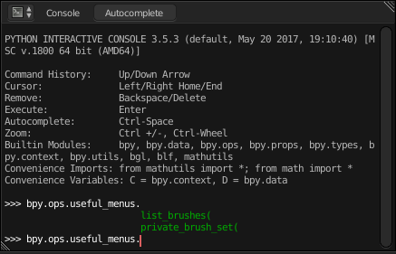
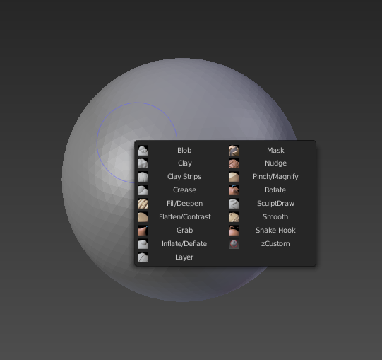

# Useful Menus Add-on for Blender

WIP addon of custom menus.

# Installing

Download zip file > In Blender > Preferences > Add-ons > Install Add-on from File > Select zip folder > Enable

# Using

I don't like add-ons that register their own shortcuts because I use a completely custom keymap so this add-on just registers the menus. To create a shortcut for a menu just set a shortcut to the idname listed for the menu you want, that's it. You can also find a list of all the idnames/operators in Blender at any time by opening the console and showing the autocomplete for `bpy.ops.useful_menus.` (default shortcut is `Ctrl+Space`).

There are a few "private" methods used by the add-on that are also exposed because they might be useful (such as allowing switching to a brush just by it's name).

# Menus

## List of Sculpt Brushes

idname: `useful_menus.list_brushes`

List of all brushes in sculpt mode with custom icons if set (unless the file path doesn't exist in which case it defaults to the brush type icon). The menu tries to auto-fit them into a square dialog so that large numbers of brushes are comfortable to view. The menu is also designed scale according to the scale of the UI (Preferences > Interface > Display > Scale).

# Private Methods

## Set Brush by Name

idname: `useful_menus.private_brush_set`

property: `name` (string)
